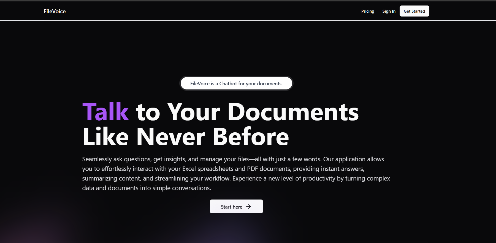

# FileVoice: Talk to Your Documents Like Never Before



## Overview

**FileVoice** is an innovative application designed to revolutionize the way you interact with your documents. With FileVoice, you can seamlessly ask questions, get insights, and manage your files—all with just a few words. This application enables effortless interaction with Excel spreadsheets and PDF documents, providing instant answers, summarizing content, and simplifying workflows.

Experience a new level of productivity by transforming complex data and documents into simple conversations.

## Features

- **Ask Questions:** Ask natural language questions about your documents and get immediate answers.
- **Summarize Content:** Quickly summarize lengthy documents and spreadsheets.
- **Interact with Data:** Manage and analyze your data from Excel and PDFs effortlessly.
- **Streamlined Workflow:** Enhance productivity by turning complicated documents into easy conversations.

## Project Structure

This project is divided into two main folders:

### Frontend - Next.js

The frontend is built with Next.js, providing a dynamic, modern interface for users to interact with their documents.

- **Technologies:** Next.js, React, Tailwind CSS
- **Key Components:**
  - Document upload and management
  - Interactive question-answer interface
  - Real-time insights from uploaded files

### Backend - Spring Boot

The backend is powered by Spring Boot, handling authentication, file processing, and document analysis.

- **Technologies:** Spring Boot, JWT Authentication, REST API
- **Key Features:**
  - Secure authentication using JWT
  - Processing and analysis of Excel and PDF documents
  - Integration with frontend for seamless user interactions

## Getting Started

### Prerequisites

Make sure you have the following installed:

- Node.js (v16+)
- Java 17 or higher
- Maven or Gradle
- Docker (for database setup, optional)

### Setting Up the Frontend

1. Navigate to the `frontend/` directory:

   ```bash
   cd frontend/
   npm i
   npm run dev
   
## License

This project is licensed under the MIT License - see the [LICENSE](LICENSE) file for details.
